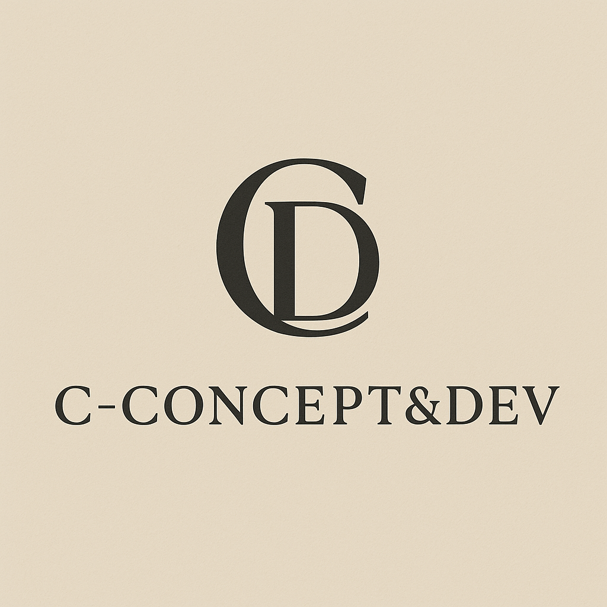

<div align="center">



# C Concept&Dev

**🧠 Framework de Clonage Psychologique Alimenté par l'IA**

[](https://github.com/11drumboy11/C-Concept-Dev)
[](LICENSE)
[]()
[]()

---

</div>

## 🎯 Vision

**C Concept&Dev** est un framework open-source pour créer des clones conversationnels psychologiquement fidèles alimentés par l'IA. Notre mission : permettre à chacun de créer son jumeau numérique qui pense, parle et réagit comme eux.

### 💡 Philosophie

> *"Un clone n'est pas une copie. C'est une continuité."*

Nous croyons que l'identité numérique du futur ne sera pas une simple base de données, mais une réplique psychologique vivante capable d'évoluer avec son original.

---

## 🚀 Système Clone Complet v12.1

Notre framework repose sur **4 composants JSON** qui, combinés, créent un clone complet :

```
🤖 CLONE COMPLET v12.1
│
├─ 1️⃣ PROMPT INSTRUCTIONS (~2K tokens)
│   ├─ Comment incarner le clone
│   ├─ Style de réponse
│   ├─ Utilisation des 3 JSONs
│   └─ Règles comportementales
│
├─ 2️⃣ JSON CERVEAU (~50K tokens / 200 KB) ✅
│   ├─ Big Five traits + facettes
│   ├─ Schwartz Values
│   ├─ Communication style
│   ├─ Emotional profile
│   └─ Behavioral patterns
│
├─ 3️⃣ JSON CONNAISSANCES (~6.6 Mo)
│   ├─ Base de connaissances complète
│   ├─ Compétences professionnelles
│   ├─ Expériences vécues
│   └─ Contextes spécifiques
│
├─ 4️⃣ JSON PERSONA (~5K tokens / 20 KB) 🆕
│   ├─ Histoire personnelle complète
│   ├─ Parcours de vie
│   ├─ Événements marquants
│   ├─ Évolutions professionnelles
│   └─ Relations importantes
│
└─ 5️⃣ SYSTÈME UPDATE 🔄
    ├─ Cerveau: nouvelle interview
    ├─ Persona: user ajoute événement
    └─ Connaissances: nouvelles formations
```

### 📥 Utilisation

```
1. Générer vos 4 JSON via nos outils
2. Upload dans Claude.ai (ou autre LLM)
3. Chatter directement avec votre clone
✅ PAS de coûts API continus
```

---

## 🛠️ Projets & Outils

### 🧠 Clone System (Projet Principal)

| Outil | Description | Status |
|-------|-------------|--------|
| **[Clone Interview Pro](tools/clone-interview-pro/)** | Génère Brain JSON via interview multi-modale (vidéo/audio/texte) | ✅ v18.5 |
| **[Persona Builder](tools/persona-builder/)** | Interface pour créer Persona JSON | 🚧 Bientôt |
| **[Knowledge Merger](tools/knowledge-merger/)** | Fusionne multiples JSON en megasearch.json | 🚧 Bientôt |
| **[Clone Tester](tools/clone-tester/)** | Valide qualité et fidélité du clone | 🚧 Bientôt |

### 🎸 Prof de Basse (Projet Secondaire)

Scripts d'automatisation pour base de connaissances musicale.

---

## 📚 Documentation

- **[Guide Démarrage Rapide](docs/QUICKSTART.md)** - Créez votre clone en 30 min
- **[Architecture Système](docs/ARCHITECTURE.md)** - Comment ça fonctionne
- **[Schemas JSON](schemas/)** - Structures de données détaillées
- **[Guide Clone Complet](docs/GUIDE-CLONE-COMPLET.md)** - Méthodologie complète
- **[API Reference](docs/API.md)** - Pour développeurs
- **[FAQ](docs/FAQ.md)** - Questions fréquentes

---

## 🎨 Branding

<div align="center">

### Charte Graphique

| Élément | Valeur |
|---------|--------|
| **Nom Marketing** | C Concept&Dev (avec &) |
| **Nom Technique** | C-Concept-Dev ou C ConceptDev |
| **Signature** | C C&D |
| **Couleur Primaire** | #8FAFB1 (Bleu-vert apaisant) |
| **Couleur Secondaire** | #C8D0C3 (Vert tendre) |
| **Couleur Tertiaire** | #E6D7C3 (Beige chaud) |
| **Couleur Accent** | #D8CDBB (Sable doux) |
| **Typographie** | Montserrat |

</div>

---

## 🚀 Démarrage Rapide

### Option 1 : Utilisateur (Créer votre clone)

```bash
# 1. Accéder à Clone Interview Pro
https://11drumboy11.github.io/C-Concept-Dev/tools/clone-interview-pro/

# 2. Faire l'interview (15-25 min)
# 3. Télécharger Brain.json
# 4. Uploader dans Claude.ai
```

### Option 2 : Développeur (Contribuer)

```bash
# Cloner le repo
git clone https://github.com/11drumboy11/C-Concept-Dev.git
cd C-Concept-Dev

# Installer dépendances Python
pip install -r requirements.txt

# Lancer tests
python -m pytest tests/

# Générer megasearch.json
python automation/clone-system/merge-all.py
```

---

## 📊 Statistiques Projet

<div align="center">

| Métrique | Valeur |
|----------|--------|
| **Lignes de code** | 27,000+ |
| **Outils** | 4 (2 actifs) |
| **Scripts Python** | 10+ |
| **Schemas JSON** | 4 |
| **Documentation** | 50+ pages |
| **Tests** | 30+ |

</div>

---

## 🔒 Sécurité & Confidentialité

⚠️ **IMPORTANT** : Les JSON générés contiennent des profils psychologiques détaillés.

### Protections

- ✅ **Données locales** : Tout reste dans votre navigateur
- ✅ **Pas de serveur** : Aucune donnée envoyée à des tiers
- ✅ **Chiffrement** : Clés API chiffrées AES-256
- ✅ **RGPD** : Google Analytics Privacy-First (anonymize_ip)
- ✅ **.gitignore strict** : JSON personnels JAMAIS committés

### Recommandations

1. ⚠️ Ne partagez JAMAIS vos JSON personnels publiquement
2. ✅ Gardez Brain.json et Persona.json **LOCAL uniquement**
3. ✅ Utilisez `.gitignore` pour éviter commits accidentels
4. ✅ Chiffrez vos backups (7-Zip AES-256 ou VeraCrypt)

---

## 🤝 Utilisation du Clone

Une fois vos JSON générés, uploadez-les sur votre plateforme IA préférée :

### Claude.ai

```
1. Settings > Custom Instructions
2. Coller le contenu du PROMPT INSTRUCTIONS
3. Ajouter les 4 JSON en pièces jointes
4. Commencer à chatter avec votre clone
```

### ChatGPT

```
1. Create Custom GPT > Instructions
2. Coller PROMPT + uploader JSON
3. Configure > Knowledge (uploader megasearch.json)
```

### Autres Plateformes

Compatibilité : Gemini, Grok, DeepSeek, LLaMA, Mistral

---

## 📈 Roadmap

### Q1 2025

- [x] Clone Interview Pro v18.5 (Test Reports + Comparator)
- [x] Structure repo C Concept&Dev
- [ ] Persona Builder v1.0
- [ ] Knowledge Merger v1.0
- [ ] Tests Beta (10 utilisateurs)

### Q2 2025

- [ ] Clone Tester v1.0
- [ ] Update Dashboard
- [ ] Multi-langue (FR + EN)
- [ ] Application mobile (React Native)

### Q3 2025

- [ ] Marketplace de templates
- [ ] API publique
- [ ] Analyse émotions temps réel
- [ ] Détection biais avancée

---

## 👨‍💻 Auteur

**Christophe BONNET**  
*Fondateur - C Concept&Dev*

- 🏥 Infirmier hémodialyse (12h shifts)
- 🎸 Professeur de basse
- 💻 Développeur (avec Claude Sonnet 4)
- 🧠 Passionné psychologie & IA

**Expertise** :
- Psychologie de la personnalité (Big Five, Schwartz)
- Systèmes multi-modaux (audio/vidéo/texte)
- Analyse comportementale temps réel
- Intelligence artificielle conversationnelle

---

## 📝 Licence

Ce projet est sous licence propriétaire. Tous droits réservés.

**Usage autorisé** :
- ✅ Usage personnel (créer votre propre clone)
- ✅ Tests et évaluations
- ✅ Recherche académique (avec citation)
- ✅ Fork pour amélioration (contributions bienvenues)

**Usage non autorisé** :
- ❌ Distribution commerciale sans accord
- ❌ Revente ou monétisation directe
- ❌ Modification et redistribution sans attribution

Pour usage commercial ou professionnel, contactez l'auteur.

---

## 🔗 Liens Utiles

- **🌐 Site Web** : [c-conceptdev.com](https://11drumboy11.github.io/C-Concept-Dev/) *(bientôt)*
- **📊 Clone Interview Pro** : [Demo Live](https://11drumboy11.github.io/C-Concept-Dev/tools/clone-interview-pro/)
- **📝 Questionnaire Feedback** : [Feedback](https://11drumboy11.github.io/C-Concept-Dev/tools/clone-interview-pro/feedback.html)
- **📖 Documentation** : [docs/](docs/)
- **🐛 Issues** : [GitHub Issues](https://github.com/11drumboy11/C-Concept-Dev/issues)
- **💬 Discussions** : [GitHub Discussions](https://github.com/11drumboy11/C-Concept-Dev/discussions)

---

## 💬 Contact & Support

**Email** : [christophe.bonnet@c-conceptdev.com](mailto:christophe.bonnet@c-conceptdev.com) *(à compléter)*  
**WhatsApp** : +33 X XX XX XX XX *(à compléter)*  
**LinkedIn** : [Christophe BONNET](https://linkedin.com/in/christophe-bonnet) *(à compléter)*

**Support technique** :
- 🐛 [Créer une issue](https://github.com/11drumboy11/C-Concept-Dev/issues/new)
- 💬 [Poser une question](https://github.com/11drumboy11/C-Concept-Dev/discussions/new)
- 📧 Email direct pour urgences

**Disponibilité** : 9h-18h CET (réponse < 24h)

---

## 🌟 Contribuer

Nous acceptons les contributions ! Voici comment participer :

### Types de contributions

1. **🐛 Signaler un bug** : [Créer une issue](https://github.com/11drumboy11/C-Concept-Dev/issues/new)
2. **💡 Proposer une feature** : [Discussion](https://github.com/11drumboy11/C-Concept-Dev/discussions)
3. **📝 Améliorer la doc** : Pull request bienvenue
4. **🧪 Tester** : [Remplir le feedback](https://11drumboy11.github.io/C-Concept-Dev/tools/clone-interview-pro/feedback.html)
5. **🌍 Traduire** : Multi-langue en cours (FR/EN)

### Workflow

```bash
# 1. Fork le repo
# 2. Créer une branche
git checkout -b feature/ma-super-feature

# 3. Faire vos modifications
git commit -m "feat: ajoute fonctionnalité X"

# 4. Push et créer Pull Request
git push origin feature/ma-super-feature
```

---

## 🙏 Remerciements

- **[Anthropic](https://anthropic.com)** - Claude API (cerveau du système)
- **[Google Cloud](https://cloud.google.com)** - Text-to-Speech API
- **[Institut du Couple](https://institutducouple.com)** - Contexte thérapeutique
- **Testeurs Beta** - 10 testeurs Phase 1-2 (merci !)
- **Communauté GitHub** - Pour le soutien et feedback

---

## 📜 Changelog

Voir [CHANGELOG.md](CHANGELOG.md) pour l'historique complet des versions.

**Dernière version** : v18.5.0 (2025-12-02)
- ✅ Test Reports + Comparator + Export Batch
- ✅ Questionnaire feedback automatique
- ✅ Mode DEV 7 onglets

---

<div align="center">

### ⭐ Si ce projet vous intéresse, laissez une étoile ! ⭐

**Made with ❤️ and 🧠 by Christophe BONNET - C Concept&Dev**

*"Votre jumeau numérique vous attend."*

---


</div>
