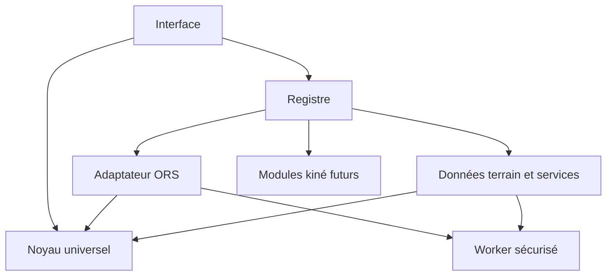

# Architecture canonique — Je marche comme je suis

## Une seule application dans le dépôt

Le répertoire `tools/Je marche comme je suis/` contient désormais l'unique
implémentation de l'application. L'ancien prototype parallèle
`tools/je-marche-comme-je-suis/index.html` a été retiré.

Le nom historique `je-marche-comme-je-suis-p0.html` est conservé uniquement
pour ne pas casser l'URL publique et les favoris existants. Son contenu n'est
plus un monolithe source : c'est un artefact autonome, entièrement reconstruit
depuis les modules du dépôt.

## Règle de construction

Les fichiers de `src/` sont les sources de référence. Le fichier public
`je-marche-comme-je-suis-p0.html` est généré par `npm run build` à partir du
gabarit et de ces modules. Il reste autonome : les modules sont intégrés dans
le HTML au moment de la construction.

Il ne faut donc jamais modifier directement le JavaScript inclus dans le HTML
généré. Toute évolution passe par le gabarit ou `src/`, puis par `npm run build`.
La CI reconstruit le fichier et refuse toute divergence.

## Noyau

`src/core/route-engine-core.js` ne connaît ni le DOM, ni Cloudflare, ni ORS. Il
transforme les réponses humaines en contraintes avec `compileConstraints()` et
contrôle une trace documentée avec `auditRoute()`.

`src/core/peripheral-registry.js` impose un contrat minimal à chaque
périphérique. Un module incomplet ou déclaré sous un type inconnu est refusé au
démarrage.

## Périphériques

- `src/peripherals/service-client.js` est le seul transport HTTP vers le Worker
  sécurisé. Il uniformise les erreurs et le comptage des appels.
- `src/peripherals/ors-provider.js` traduit les contraintes compilées en demande
  de boucles ORS. Il ne décide jamais qu’une route est compatible : cette
  décision appartient au noyau.
- `src/peripherals/geoapify-provider.js` transforme les données Geoapify en
  preuves structurées proches de la trace.
- Les prochains adaptateurs météo, terrain et Mapillary suivront le même
  principe : fournir des preuves structurées au noyau, sans modifier les
  contraintes humaines.

## Interface

`src/app.js` orchestre le formulaire, la carte et l’affichage. Il peut demander
une route à un périphérique et transmettre ses preuves au noyau, mais il ne doit
pas contenir de nouvelle règle fonctionnelle isolée.

## Direction prévue

Les modules kiné futurs pourront ajouter des questions, des règles dérivées et
des critères d’arrêt. Ils ne pourront ni assouplir une limitation physique ni
remplacer une preuve absente par une supposition.
