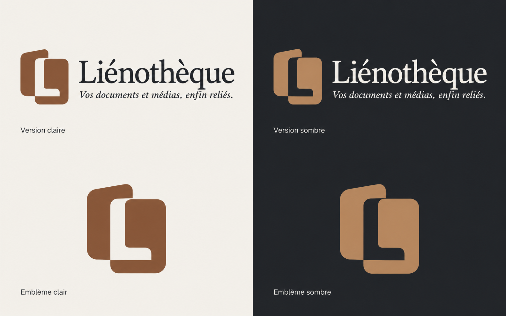
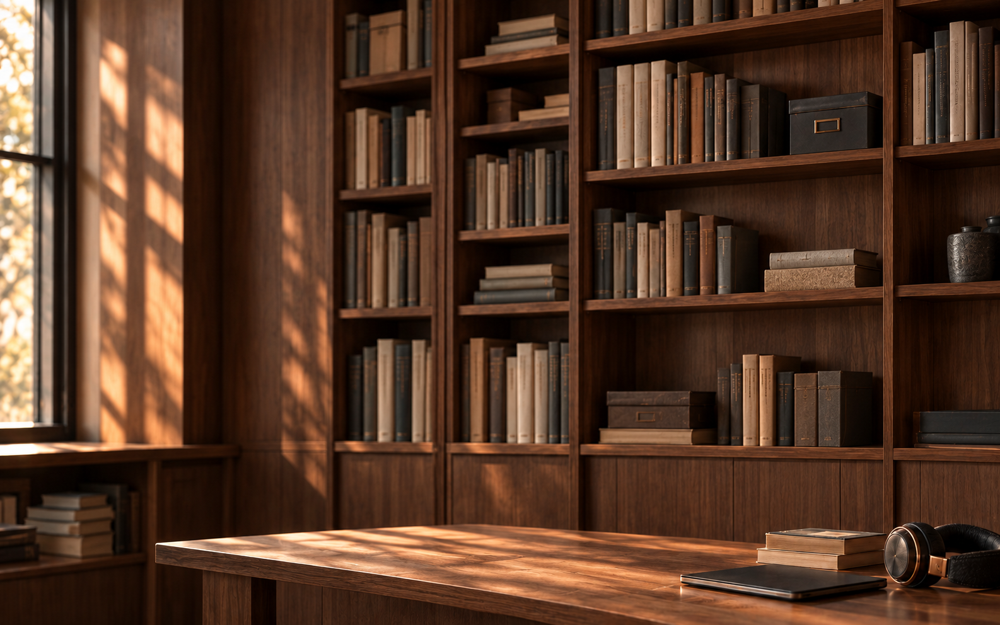

# Liénothèque - Charte graphique complète v3.0

## Charte graphique
Bibliothèque contemporaine • Référence complète de la direction utilisée

**Liénothèque**
Vos documents et médias, enfin reliés.

Une bibliothèque universelle pour organiser documents, livres, audios, vidéos et images, puis retrouver les relations entre eux. Une présence sobre, structurée et chaleureuse : graphite, papier ivoire, noyer et cuivre.

**Statut.** Charte validée comme référence de conception par l’assistant, sur délégation explicite du propriétaire produit le 3 octobre 2026. Cette validation porte sur les règles et jetons, pas sur une conformité automatique des maquettes ou du code. Les valeurs de ce document constituent la cible d’intégration ; une image générée ne garantit ni les polices ni les dimensions exactes.

**Périmètre.** Identité, photographie, palette, typographie, grille, composants, accessibilité, adaptations et règles de contrôle. Cette direction remplace le vert sauge de la charte précédente.

## 01. Identité et intention
Solide • Lisible • Universelle • Accueillante

### Positionnement

Liénothèque réunit les médias et rend leurs liens accessibles : une page associée à une piste audio, un livre à son livre audio, une vidéo à sa transcription. Le bénéfice doit rester visible au-delà de la métaphore des rayonnages.

### Traduction du souhait « masculin »

Des lignes nettes, une structure stable, des contrastes francs et des matières sobres. Cette intention esthétique ne définit pas le public : l’application reste destinée à toute personne et à tout domaine.

| Qualité recherchée | Traduction graphique |
| --- | --- |
| Solidité | Graphite, géométrie régulière, panneaux opaques |
| Chaleur | Ivoire, photographie de noyer, accent cuivre |
| Clarté | Inter, hiérarchie courte, libellés explicites |
| Lien | Fil discret entre deux contenus, flèche et destination |
| Universalité | Exemples variés, aucun univers professionnel dominant |

### Principes à préserver

Reprendre attire l’œil en premier. La recherche reste permanente. Les contenus priment sur le décor. Une seule action principale domine l’écran. Aucun état ni aucune relation ne dépend de la couleur seule.

### Éléments exclus

Vert dans les jetons de marque et le décor photographique ; néons, effets métalliques simulés, dégradés de composants, cartes transparentes, glassmorphism, textures derrière les textes de travail. Les médias importés par l’utilisateur conservent leurs propres couleurs.

## 02. Palette de référence
Valeurs cibles pour l’interface • sRGB

| Couleur | Hex | Usage |
| --- | --- | --- |
| Graphite | #202327 | Structure, texte principal, barre permanente |
| Ivoire | #F4F1EB | Cartes, panneaux, fonds de lecture |
| Gris secondaire | #62666B | Métadonnées et informations secondaires |
| Pierre | #D8D0C5 | Filets, séparateurs, piste de progression |
| Cuivre sombre | #875638 | Action principale, liens, accents |
| Cuivre clair | #B88B62 | Fil, progression et détails graphiques |
### Couleurs complémentaires et collections

Survol cuivre : **#70452D**. Ardoise : **#555A60**. Noyer : **#654A36**. Taupe : **#8A7B6A**. Ces teintes servent aux bandeaux de collections, sans sens fonctionnel. Affectation : Méthode d’instrument graphite #202327 ; Bibliothèque de recherche ardoise #555A60 ; Cours vidéo noyer #654A36 ; Archives photo taupe #8A7B6A. Le cuivre est réservé aux actions, aux liens et au fil, jamais à un bandeau de collection.

Vérification : fond **#F3E1C6**, texte **#75451F**. Erreur : **#9F3434** accompagné d’une icône et d’un message. Prêt et synchronisé utilisent un pictogramme et un libellé graphite ou cuivre, sans vert.

**Répartition conseillée.** Surfaces neutres majoritaires ; cuivre concentré sur les actions et les liens. Ne pas utiliser le cuivre clair comme texte sur ivoire.

## 03. Lisibilité et accessibilité
Contrastes calculés sur les couleurs unies de référence

| Combinaison | Ratio | Usage |
| --- | --- | --- |
| #202327 / #F4F1EB | 13.99:1 | Texte principal |
| #62666B / #F4F1EB | 5.13:1 | Texte secondaire |
| #875638 / #F4F1EB | 5.45:1 | Liens et libellés |
| #FFFFFF / #875638 | 6.14:1 | Bouton principal |
| #F4F1EB / #202327 | 13.99:1 | Barre sombre |
| #B88B62 / #F4F1EB | 2.70:1 | Graphique seulement |

Cible WCAG 2.2 AA : au moins 4,5:1 pour le texte courant, 3:1 pour le grand texte et les éléments graphiques nécessaires à la compréhension. Les ratios ci-dessus ne valident pas à eux seuls l’ensemble de l’interface.

### Photographie et contraste

Les titres sur le fond photo nécessitent une zone sombre stable. Vérifier le contraste au point le plus clair situé sous chaque texte. Bonjour, la synthèse, Reprendre et Vos bibliothèques reposent sur le même panneau graphite #202327 entièrement opaque. Aucune différence d’opacité entre les deux titres de section ; ratio ivoire/graphite calculé : 13,99:1. Le contraste de 3,4:1 signalé dans la maquette est un constat utilisateur, non une mesure indépendante de ce document. Les cartes de travail restent entièrement opaques.

### Interaction

Focus clavier visible : contour cuivre de 2 px sur surface claire ; contour ivoire sur graphite. Les liens sont soulignés. Les erreurs utilisent une icône et un texte. Les actions doivent être accessibles au clavier, sans dépendre du glisser-déposer.

### Taille et confort

Texte courant 15 à 16 px ; métadonnées au moins 13 px. Cible interactive recommandée 40 à 44 px, minimum 24 × 24 px sous réserve des exceptions WCAG. Zoom à 200 % sans perte de contenu. Respecter la préférence système de réduction des animations.

## 04. Typographie et logo
Une expression éditoriale, une interface de travail nette

| Élément | Police cible | Taille / graisse |
| --- | --- | --- |
| Logo | Source Serif 4 | Taille adaptée au bloc de 28 px |
| Bonjour | Source Serif 4 | 28 à 32 px / Medium |
| Titres de section | Inter | 13 px / Medium 500 |
| Noms de bibliothèques | Inter | 17 à 18 px / Semibold 600 |
| Texte courant et boutons | Inter | 15 px / Regular ou Medium |
| Métadonnées et badges | Inter | 13 px / Regular ou Medium |

Casse normale, sans espacement artificiel des lettres. Interlignage courant 1,45 à 1,6. Pas de serif pour les compteurs, les métadonnées ou les commandes. Ce PDF utilise DejaVu pour sa composition ; les polices cibles ci-dessus concernent le produit.

### Logo horizontal compact

Nouvel emblème géométrique : deux cadres de documents emboîtés dont l’espace central évoque un L, à gauche de « Liénothèque », sur une seule ligne. Hauteur du bloc 28 px ; marge de protection au moins 8 px. Prévoir 16 px de marge dans la barre, en tenant compte des contrôles macOS pour éviter tout chevauchement.

Sur graphite : mot ivoire et emblème cuivre clair. Sur ivoire : mot graphite et emblème cuivre sombre. Le nouvel emblème ne contient aucun fil. Le fil reste un motif de l’interface : relations page-piste, flèches et progression. À petite taille, préserver les deux formes pleines et le L en réserve ; supprimer les détails qui deviennent illisibles. Créer un master vectoriel avant l’intégration : la maquette raster n’est pas le fichier de logo final.

### Signature

« Vos documents et médias, enfin reliés. » accompagne les supports de présentation et l’accueil vide. Elle ne figure pas sous la recherche dans la page principale active. Ne pas ajouter une deuxième promesse.

## 05. Photographie de fond
Une bibliothèque contemporaine, sans spécialisation

### Sujet et composition

Rayonnages de noyer, livres génériques sans titres lisibles, quelques boîtes d’archives ; un casque audio et une tablette peuvent évoquer la diversité des médias. Aucun personnage, aucune marque, aucun document personnel. Exclure les plantes et dominantes vertes.

Photographie réaliste, lumière latérale naturelle, teintes chaudes modérées. Éviter l’accumulation d’objets, les décors luxueux ostentatoires et le style club privé. Garder de grandes zones calmes autour de la grille, surtout derrière Bonjour et les titres de section.

### Traitement

Image fixe, recadrage cover, sans parallaxe. Voile graphite uniforme recommandé : point de départ à 55 %, à ajuster selon l’image et les mesures de contraste. Aucun flou de verre. L’image peut être désaturée pour rester dans les tons graphite, noyer et taupe.

### Placement et adaptation

Le fond est visible dans les marges, l’en-tête de bienvenue et les espaces libres. Les cartes restent ivoire opaque. Sur petits écrans ou en mode concentration, utiliser un fond uni : graphite ou ivoire. Fournir aussi une option « Masquer la photographie ».

### Production et droits

Source haute résolution adaptée aux écrans Retina ; prévoir AVIF ou WebP avec repli. Charger la photo après la structure pour garder une interface immédiatement utilisable. Utiliser une création originale ou une image dont les droits couvrent l’application et ses supports commerciaux.

### Lecture critique de la maquette

La maquette intègre le nouveau logo et reprend le décor choisi. Les maquettes restent des illustrations de composition, jamais des références typographiques pour les noms de cartes, le grand 9 et le traitement en cours : ces éléments utilisent obligatoirement Inter. Leur bandeau Cours vidéo trop proche du bouton doit devenir noyer #654A36. Le panneau Vos bibliothèques doit devenir identique à Reprendre. Les zones cachées de la photographie ont été reconstituées par génération ; le fond seul est un nouvel asset dérivé, pas une extraction exacte de pixels invisibles.

## 06. Grille et composants
Règles de référence pour reproduire la page principale

| Composant | Spécification |
| --- | --- |
| Grille | Pas de 8 px ; deux colonnes environ 2/3 et 1/3 ; gouttière 24 à 32 px |
| Surfaces | Ivoire opaque ; filet pierre 1 px ; rayon 8 px ; ombre légère uniquement pour les éléments flottants |
| Reprendre | Trois cartes compactes ; bord gauche cuivre 3 px ; source, position exacte et date |
| Bibliothèques | Grille de quatre cartes ; bandeau, nom, compteurs, hébergement, état, dernière ouverture |
| Action principale | Nouvelle bibliothèque ; cuivre sombre ; texte blanc ; hauteur 40 px ; rayon 8 px |
| Liens | Cuivre sombre sur ivoire ; soulignement ; cuivre clair seulement sur fond sombre avec contraste vérifié |
| Progression | Trait 3 px ; bouts arrondis ; cuivre clair sur pierre ; 60 % ; indication textuelle |
| Dépôt | Cadre pointillé cuivre ; hauteur indicative 150 px ; commande de sélection de fichiers accessible |

### Icônes et états

Icônes au trait de type Lucide, 18 à 20 px, épaisseur cohérente. Ordinateur : écran. Cloudflare : nuage. Mixte : écran et nuage côte à côte. Les états Prêt, En traitement et Synchronisé comportent un libellé.

### Hiérarchie

Barre permanente : logo, recherche, traitement, synchronisation, notifications et compte. Bonjour puis synthèse des bibliothèques. Reprendre précède Vos bibliothèques. Le haut de À vérifier s’aligne sur le titre Reprendre. Traitement et dépôt suivent dans la colonne latérale.

## 07. Déclinaisons et jetons
Une seule source de vérité pour le produit

### Thèmes

Trois variantes sont distinguées : clair de concentration (fond ivoire, cartes #FBF9F5), hybride photographique (fond photo, panneaux de titres graphite, cartes ivoire) et sombre intégral (fond et cartes sombres, sans photo). L’hybride ne remplace pas le sombre intégral. Les jetons clair/sombre ci-après sont la référence avant le lot C.

### Jetons de référence

| Jeton | Valeur |
| --- | --- |
| color.text.primary / color.shell |  #202327 |
| color.surface / color.text.inverse | #F4F1EB |
| color.text.secondary | #62666B |
| color.border / color.progress.track | #D8D0C5 |
| color.action / color.link | #875638 |
| color.action.hover | #70452D |
| color.thread / color.progress.fill | #B88B62 |
| radius.card / radius.button | 8 px / 8 px |
| space.unit / size.progress | 8 px / 3 px |
| font.ui / font.brand | Inter / Source Serif 4 |
| motion.duration | 150 à 200 ms ; désactivation si mouvement réduit |

Les composants utilisent ces jetons au lieu de valeurs isolées. Les couleurs des collections sont des variantes de surface ; elles ne doivent pas modifier l’action principale. Les jetons d’erreur, focus, désactivation et sélection doivent être contrôlés dans chaque thème.

### À faire / À éviter

**À faire :** surfaces stables, texte net, fil discret, pictogrammes explicites, fonds calmes.
**À éviter :** texte sur des dos de livres, cartes translucides, cuivre partout, détails fins du logo, décoration animée, nuances vertes dans le décor de marque.

## 08. Validation et références
Checklist d’intégration • Origine de la direction

### Contrôles avant livraison

1. Appliquer la direction et les trois variantes définies dans cette charte.
2. Produire le logo vectoriel et ses variantes claires/sombres.
3. Appliquer Inter à toute l’interface, sauf logo et Bonjour.
4. Supprimer les végétaux et le vert du décor.
5. Vérifier contrastes, focus, survol, erreurs et états désactivés.
6. Contrôler clavier, zoom à 200 %, mode sans photo et petite largeur.
7. Vérifier tous les libellés, compteurs et alignements sur la grille.
8. Tester le poids du fond et l’affichage avant chargement de l’image.

### Benchmark consulté le 3 octobre 2026

Zotero - priorité à l’organisation des collections et à la recherche.
https://www.zotero.org/

Readwise Reader - centralisation de plusieurs formats de lecture et de vidéo.
https://readwise.io/read

Raindrop.io - collections, filtres et plusieurs vues pour retrouver les contenus.
https://raindrop.io/

Eagle - organisation, recherche et consultation d’une bibliothèque de médias.
https://eagle.cool/home

Ces références portent sur les présentations publiques des produits, pas sur leurs chartes internes. La palette graphite-cuivre et la photographie sont une proposition originale pour Liénothèque ; elles ne reproduisent pas une charte concurrente.

### Gouvernance de la charte

Version 3.0 : nouveau logo géométrique créé de zéro, photographie autonome reconstituée et deux thèmes de référence mis à jour le 3 octobre 2026. Validation de conception déléguée par le propriétaire produit à l’assistant le 3 octobre 2026. Les règles et jetons de cette version font référence et prévalent sur les images. Restent à contrôler sur le code : polices, interactions, recadrages, contrastes des états et accessibilité clavier. Aucun accord de déploiement ni validation du lot C n’est implicite.

## 09. Nouveau logo
Deux documents reliés • Un L dans l’espace central

Le nouvel emblème remplace entièrement le livre ouvert précédent. Deux formes de documents emboîtées évoquent la relation et la collection. L’espace central suggère un L. Aucune dépendance à un domaine particulier.

Version claire : emblème cuivre sombre, mot graphite sur ivoire. Version sombre : emblème cuivre clair, mot ivoire sur graphite. Géométrie identique, jamais étirée. La signature reste réservée aux supports de présentation.

Zone de protection : au moins un quart de la hauteur de l’emblème. Tester à 32 px ; fournir un master vectoriel avant production. La planche fournie est une référence raster et ne constitue pas encore ce master.

## 10. Fond photographique seul
Asset autonome • Sans logo, interface ni texte

Fond reconstitué à partir de la photographie visible dans la pièce jointe : rayonnages de noyer, lumière latérale, archives, livres, casque et tablette. Aucun personnage, aucune plante. Les éléments masqués par l’interface ont été reconstruits ; leur fidélité exacte ne peut être garantie.

Le master est livré sans voile sombre permanent afin de permettre d’autres usages. Dans l’application, appliquer un voile graphite d’environ 55 % et un panneau opaque ou voile local d’au moins 70 % sous les titres ; contrôler les contrastes. Ne jamais placer de texte courant directement sur la fenêtre lumineuse.

Réutilisation : couverture de document, présentation, bannière ou accueil. Recadrer en conservant les rayonnages et, si possible, les médias en bas à droite. Ne pas étirer. Pour un fond de lecture, choisir le thème uni. Pour une nouvelle largeur, vérifier le recadrage et la lisibilité à nouveau.

## 11. Maquettes illustratives
Hybride photographique et clair • Non normatives pour la typographie

Accueil avec photographie et nouveau logo - illustration de composition uniquement, écarts décrits au chapitre 05

Accueil clair sans photographie - illustration de composition uniquement, écarts décrits au chapitre 05

## 12. Jetons clair et sombre
Référence de conception avant intégration du lot C

| Jeton | Clair | Sombre intégral |
| --- | --- | --- |
| background | #F4F1EB | #181A1D |
| shell / surface | #F4F1EB / #FBF9F5 | #202327 / #202327 |
| surface.hover | #EDE7DF | #2B2F34 |
| text.primary | #202327 | #F4F1EB |
| text.secondary | #62666B | #B8B6B1 |
| border.decorative | #D8D0C5 | #44494F |
| control.border | #62666B | #8B9198 |
| action.background | #875638 | #B88B62 |
| action.text | #FFFFFF | #202327 |
| action.hover | #70452D | #C99E78 |
| link / focus | #875638 | #D2A77F |
| thread / progress.fill | #B88B62 | #B88B62 |
| progress.track | #D8D0C5 | #44494F |
| selection.background | #F3E1C6 | #493425 |
| selection.text | #202327 | #F4F1EB |
| warning.background / text | #F3E1C6 / #75451F | #493425 / #F1C58E |
| error.text | #9F3434 | #F0A59E |
| disabled.background / text | #E6E0D7 / #62666B | #2B2F34 / #B8B6B1 |

En sombre, une action cuivre clair porte du texte graphite, jamais blanc : le contraste calculé est plus élevé. Le survol reste dans la même famille de couleur. Les états Prêt et Synchronisé portent une icône et un libellé, sans vert.

L’hybride reprend les jetons clairs pour ses cartes et boutons, et ceux du sombre pour la barre et les panneaux de titres. Les médias de l’utilisateur gardent leurs couleurs. Les séparateurs décoratifs ne servent pas de bordure à un champ essentiel.

## 13. Vérifications des jetons
Ratios calculés • La validation du code reste distincte

| Combinaison | Ratio | Seuil |
| --- | --- | --- |
| Texte sombre | 13.99:1 | 4.5:1 |
| Secondaire sombre | 7.79:1 | 4.5:1 |
| Bouton sombre | 5.19:1 | 4.5:1 |
| Survol bouton sombre | 6.49:1 | 4.5:1 |
| Lien sombre | 7.19:1 | 4.5:1 |
| Erreur sombre | 7.95:1 | 4.5:1 |
| Avertissement sombre | 7.28:1 | 4.5:1 |
| Champ sombre | 4.96:1 | 3:1 |
| Focus sombre | 7.19:1 | 3:1 |
| Champ clair | 5.50:1 | 3:1 |
| Titre hybride | 13.99:1 | 4.5:1 |

Progression : cuivre clair sur pierre = 2,70:1. Cette paire ne doit pas être seule porteuse de l’avancement : afficher un pourcentage textuel et une limite graphite de 1 px sur le remplissage en thème clair/hybride. En sombre, cuivre clair sur piste #44494F dépasse 3:1. Le fil est décoratif ; la relation est aussi explicitée par texte ou flèche.

Les contrôles de contraste couvrent les surfaces unies définies ici. Ils ne valident pas les rasters générés. Les trois variantes doivent être contrôlées au clavier, au zoom et avec leurs états de survol, focus, erreur, sélection et désactivation avant la livraison du lot C.

Décision : charte v3.0 validée comme référence de conception. Maquettes antérieures conservées comme illustrations annotées. La palette, les règles et les jetons priment sur leur rendu. Logo vectoriel et conformité de l’interface restent des livrables de production distincts.

## Assets associés
- Logo : Lienotheque-Logo-Planche-v2.png
- Fond seul : Lienotheque-Fond-Noyer.png
- Accueil sombre : Lienotheque-Accueil-Sombre-v2.png
- Accueil clair : Lienotheque-Accueil-Clair-v2.png

## Illustrations non normatives
Les maquettes v2 sont conservées pour leur composition ; appliquer les corrections v3 avant intégration.

